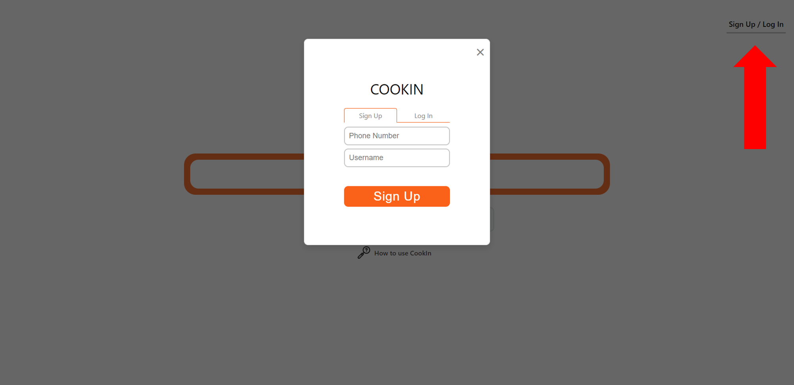
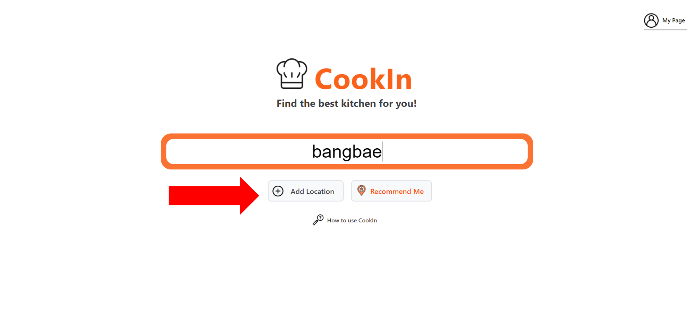
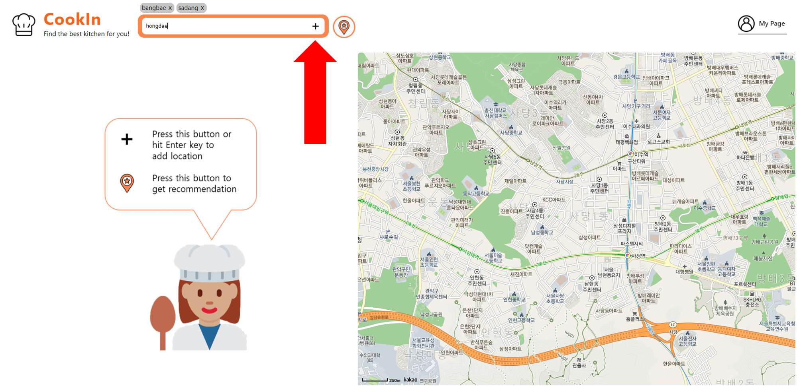
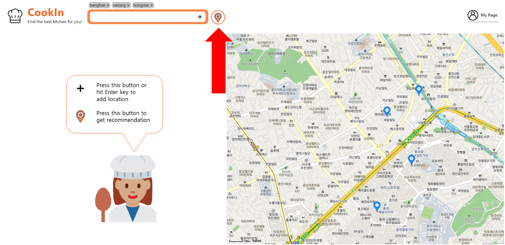

# CookIn by Team MISS
Our application aims to target the following issue:  
___Busy Koreans in their 20s who work and want cookouts with friends need to have an AirB&B for kitchens showing nearby kitchens that can provide proper tools and ingredients because difficulty in finding an adequate location hinders their chances to hold a cookout.___

## Period
2021.04 ~ 2021.06

## Prototype link
<a href="http://hcidp4.web.app/">CookIn</a>

## Website
https://hcidp4.web.app/

## Guidelines
- Phone number for test: 01012345678
- Reommend to add locations in Seoul as input to get reasonable recommendation
(Our prototype recommendation algorithm choose best place among 4 places (Hongdae University Station, Gangnam station, Yeouido Station, Jongno 3-ga Station) with distance from inputs)
- Recommend Chrome browser
- Keep full screen while testing

## Description
To tackle this issue we decided to use React.js for our website and used Google Firebase's Cloud Firestore feature for our kitchen and user database.

#### Features
##### Main Features
We focused on tackling 4 main features related to the issue:
1. Give users the closest location depending on different location inputs
2. Give users several kitchen choices with different prices, tools, and ingredients
3. Allow users to buy ingredients from the kitchen 
4. Allow users to reserve that kitchen 

##### Additional Features
To allow users to return to their choice, we added a simple login feature that only takes cellphone number and name. After a simple sign up, returning users can check their reservation by signing in through their phone numbers. 

#### Needs for Improvement
We have not implemented a more advanced search feature involving filtering because of lack of time and experience using React and Firebase.
Furthermore, the website uses a fixed database with realistic, but fake, data since for the actual application, we would need to get information from the actual kitchen.

## Credits
Application created by Team MISS (Make It Simple & Sensitive)
 - Sangkyung Kwak
 - Jinyeop Kim
 - Seunghyuck Park 
 - Kunwoo Song

## Library and Frameworks Used
- <a href="https://firebase.google.com/?hl=ko">Firebase</a> - web based database system
- <a href="https://apis.map.kakao.com/web/">KakaoMap API</a> - map API from kakao
- <a href="https://www.npmjs.com/package/react-redux">React-redux</a> - npm react-redux
- <a href="https://www.npmjs.com/package/swiper">react-swiper</a> - npm react-swiper
- <a href="https://www.npmjs.com/package/react-tabs">react-tabs</a> - npm react-tabs
- <a href="https://www.npmjs.com/package/react-modal">react-modal</a> - npm react-modal

## Codes
- ./src/Routes.js contains links to each pages
- UIs are organized with Pages-Views-items-buttons order
- Each pages call views and views call items and buttons
- Divided by Components, Images, Pages, Config and Reducers folder
- ./src/images and ./src/img folders contain our image files used by web site
- Reducers in ./src/reducers/ folder contains our states using redux and functions controlling states
- ./src/config/store.js contains persist store

## Tutorial for CookIn
### Login

### Search

### Add location

### Get recommendation

### Choose restaurant

### Choose ingredients

### Choose date

### Check reservation on mypage

